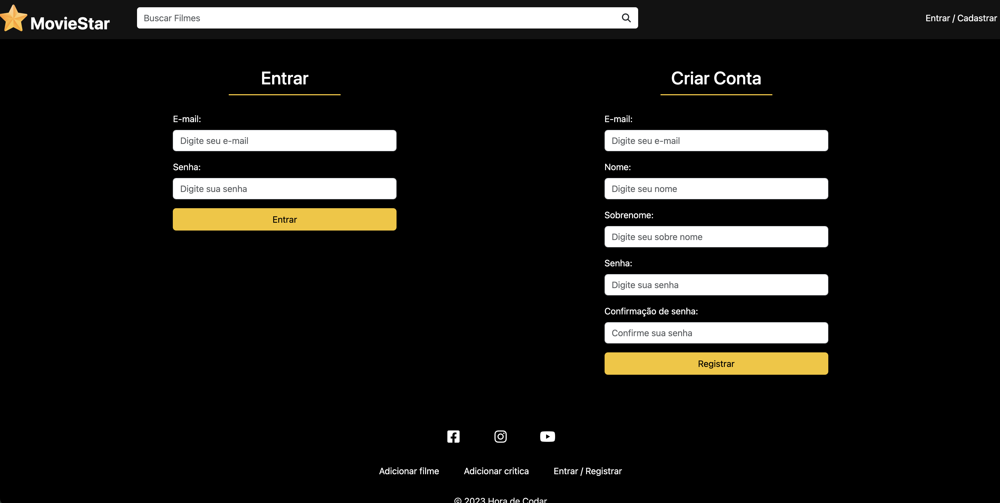

<h1 align="center">
    <a style="color: #f5c518">🔗 Movie Start</a>
</h1>

🚀 API com a finalidade de cadastrar filmes, adicionar comentarios e a nota

<h4 align="center"> 
	🚧  Movie Start 🚀 Em construção...  🚧
</h4>

<h1 align="center">
  
</h1>

### 🛠 Tecnologias

As seguintes ferramentas foram usadas na construção do projeto:

- Laravel
- PHP
- Banco de dados MYSQL